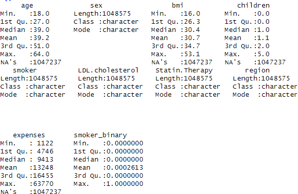
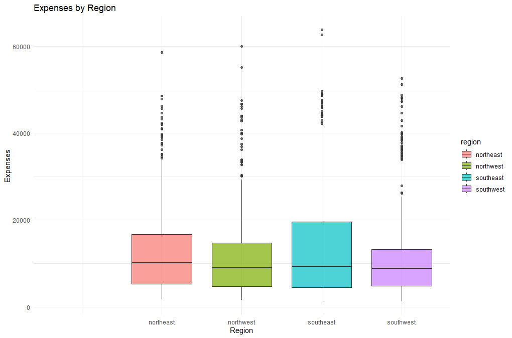

# Health Insurance Dataset Analysis



## Overview
This repository contains the analysis and visualization of a health insurance dataset. The project focuses on exploring the dataset, cleaning the data, and generating insightful visualizations to understand trends and relationships. It also includes tasks like data transformation, handling missing values, and analyzing specific attributes such as expenses and cholesterol levels.

This project serves as an example of leveraging R for exploratory data analysis (EDA), data cleaning, and visualization, and showcases how these skills can be applied to real-world datasets.

---

## Features
### 1. **Data Exploration**
- Summarizes the dataset, including attribute descriptions and types.
- Visualizes the structure and distribution of the data.
- Generates basic statistical insights.
  
**Example Output:**  


---

### 2. **Data Cleaning**
- Handles missing values in critical columns (e.g., `Statin.Therapy`).
- Transforms categorical variables (e.g., `smoker`, `Statin.Therapy`) into binary attributes for easier analysis.
- Corrects noisy data in numerical columns like `expenses`.

---

### 3. **Data Transformation**
- Converts specific attributes (e.g., `smoker`, `Statin.Therapy`) into binary format for enhanced analysis.
- Identifies candidates for statin therapy based on cholesterol levels.

---

### 4. **Visual Insights**
The project uses `ggplot2` to create meaningful visualizations, providing insights into relationships within the data.

#### Key Visualizations:
1. **Expenses by Region**  
   - Shows average medical expenses across different geographic regions.
   - Highlights regional disparities in healthcare costs.  
   

2. **Distribution of Expenses**  
   - Visualizes the distribution of medical expenses using histograms and density plots.

3. **Cholesterol Levels vs. Statin Therapy**  
   - Explores the relationship between cholesterol levels and the likelihood of receiving statin therapy.

4. **Smoker Status and Expenses**  
   - Compares average medical expenses for smokers vs. non-smokers.

---

## Installation and Setup
1. **Clone the Repository**
   ```bash
   git clone https://github.com/yourusername/health-insurance-analysis.git
   cd health-insurance-analysis
   ```

2. **Ensure R is Installed**
   - Install R from [CRAN](https://cran.r-project.org/).

3. **Install Required Packages**
   Run the following commands in R to install dependencies:
   ```R
   install.packages("tidyverse")
   install.packages("ggplot2")
   ```

4. **Run the Analysis**
   - Open the `analysis.R` file in RStudio or your preferred R IDE.
   - Execute the script step-by-step to perform data cleaning and generate visualizations.

---

## Dataset
The dataset used in this project is named `insurance_noisy.csv` and contains the following attributes:
- `age`: Patient's age.
- `sex`: Patient's gender.
- `bmi`: Body Mass Index (BMI).
- `children`: Number of dependents covered by insurance.
- `smoker`: Smoking status of the patient.
- `LDL.cholesterol`: LDL Cholesterol level.
- `Statin.Therapy`: Whether the patient is under Statin Therapy.
- `region`: Patient's geographic region.
- `expenses`: Medical expenses incurred.

---

## Project Objectives
1. **Understand the dataset**:
   - Explore relationships between variables like smoking status, cholesterol levels, and medical expenses.
2. **Clean and transform the data**:
   - Handle missing values and correct noisy data.
3. **Generate insights using visualization**:
   - Identify trends, patterns, and disparities in healthcare costs.

---

## Visualizations
### Expenses by Region
Illustrates regional differences in medical expenses.


### Data Exploration
Summarizes the dataset structure and distributions.


---

## Technologies and Tools
- **Programming Language**: R
- **Libraries**: `tidyverse`, `ggplot2`
- **Tools**: RStudio, GitHub

---

## Future Improvements
- Incorporate advanced statistical models for predictive analysis.
- Add interactivity to visualizations using `shiny` or similar frameworks.
- Analyze correlations between `bmi`, smoking status, and medical expenses.

---

## Contribution
Contributions are welcome! Feel free to fork the repository and submit pull requests. For major changes, please open an issue first to discuss the proposed modifications.

---

## License
This project is open-source and available under the [MIT License](LICENSE).

---

## Author
**Jeremiah Ochepo**  
- [GitHub Profile](https://github.com/yourusername)
- [Email](mailto:jochepo4growth@gmail.com)

---

Happy Analyzing! 🎉